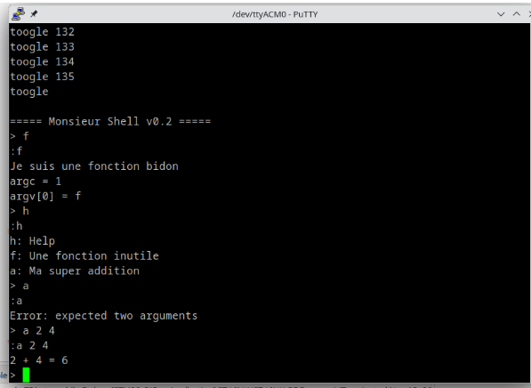

# TP de Synthèse – Autoradio  
**Kenny & Mantou**

---

## 1. Démarrage

### 1.1 Création du projet
Nous travaillons avec la **NUCLEO-L476RG** dans **STM32CubeIDE**.  
Tous les périphériques ont été laissés avec leur configuration par défaut et la **BSP n’a pas été activée** afin d’obtenir un projet minimal.

---

### 1.2 Test de la LED LD2
Un premier test fonctionnel a validé le toggle simple de la LED LD2.  
Cela permet de confirmer :
- l’initialisation correcte du GPIO,
- la chaîne compilation → flash → exécution.

---

### 1.3 Test de l’USART2 (ST-Link interne)
L’USART2 a été configuré pour :
- communiquer avec un terminal série,
- afficher des messages,
- intégrer un shell dans la suite.

---

### 1.4 Fonction `printf`
Redirection du `printf` vers l’USART2 :

```c
int __io_putchar(int chr)
{
    HAL_UART_Transmit(&huart2, (uint8_t*)&chr, 1, HAL_MAX_DELAY);
    return chr;
}
```
Le terminal série reçoit désormais les messages envoyés avec printf().

### 1.5 Activation de FreeRTOS

FreeRTOS a été activé dans STM32CubeIDE en mode CMSIS V1.

### 1.6 Mise en place du Shell
a)b) Shell dans une tâche FreeRTOS et en mode interruption

Shell exécuté dans une tâche dédiée avec une boucle de traitement.


c) Shell avec un driver structuré


## 2. GPIO Expander & VU-Mètre
### 2.1 Configuration
1) Référence du GPIO Expander

Le GPIO Expander utilisé est un MCP23S17 (Microchip).
La datasheet a été étudiée pour déterminer les registres et la configuration SPI.

2) SPI utilisé sur le STM32

La communication avec le MCP23S17 utilise le SPI3 du STM32L476.

3) Configuration STM32CubeIDE

Éléments configurés :

Mode : Full-Duplex Master

Vitesse : 8 Mbit/s (limitation MCP23S17 = 10 MHz)

Data size : 8 bits

First bit : MSB First

Clock polarity/phase : Mode 0

Chip Select (nCS) : PB7 en Output Push-Pull

### 2.2 Tests


## 3. Le CODEC Audio SGTL5000
### 3.1 Configuration préalable 
1) L'I2C utilise les pins PB10(SCL) et PB11(SDA). Cela correspond à l'I2C2. 

### 3.2 Configuration du CODEC par l'I2C 

1)


2)


